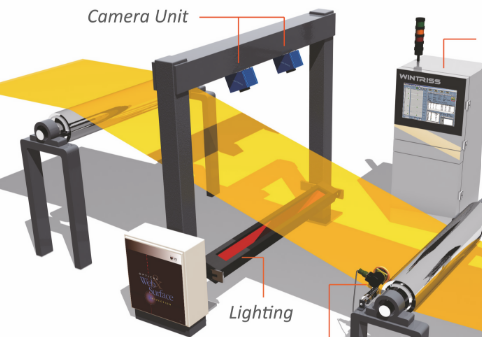
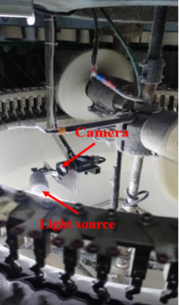
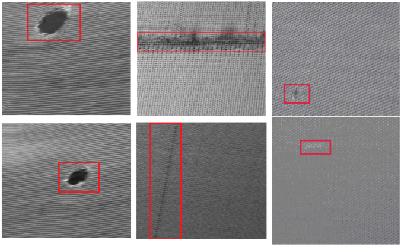

# Over_view
This project is an AI-powered solution for automated textile defect detection, combining EfficientNet for classification and YOLOv11 for object detection. The system is deployed on both the edge (Raspberry Pi) for real-time inference and the cloud (AWS) for scalable processing. To offer flexibility, it includes both a Streamlit and a Flask app, allowing users to choose the one that best fits their needs, whether for interactive visualization with Streamlit or for robust, scalable deployment with Flask. This architecture enhances inspection efficiency, reduces manual intervention, and accelerates the textile quality control process

